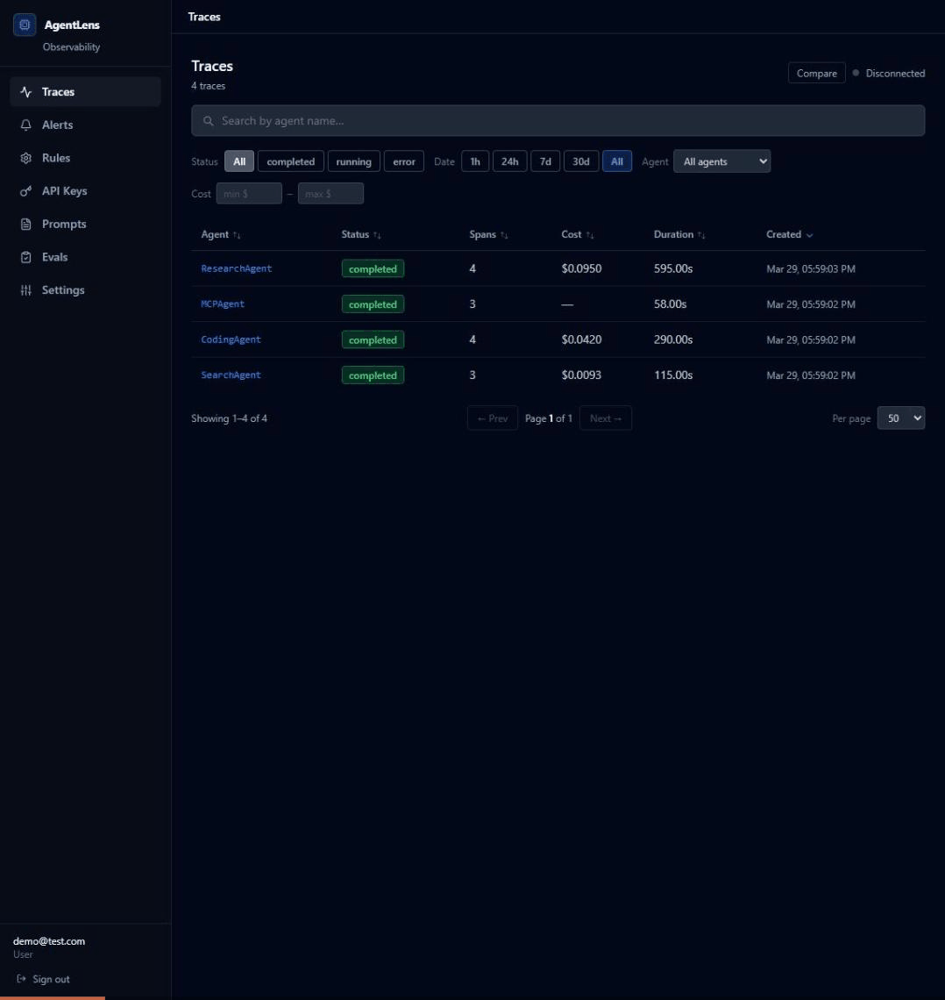

<h1 align="center">AgentLens</h1>

<p align="center">
  <strong>Chrome DevTools for AI Agents</strong> — Self-hosted, open-source observability with AI-powered failure analysis
</p>

<p align="center">
  <a href="https://github.com/tranhoangtu-it/agentlens/actions"></a>
  <a href="https://github.com/tranhoangtu-it/agentlens/releases"></a>
  <a href="https://github.com/tranhoangtu-it/agentlens/blob/main/LICENSE"></a>
  
  
  
  
</p>

---

<p align="center">
  
</p>

## The Problem

When your AI agent fails in production, you're blind. Logs show API calls, but they don't show you **WHY** the agent chose tool A over tool B, or **WHERE** its reasoning went wrong.

## The Solution

AgentLens records every step of your agent's execution and lets you **replay, debug, and analyze failures** — with AI.

## Get Started in 60 Seconds

```bash
pip install agentlens-observe
docker compose up  # Dashboard at http://localhost:3000
```

```python
import agentlens

agentlens.configure(server_url="http://localhost:8000", api_key="your-key")

@agentlens.trace
def my_agent(query):
    with agentlens.span("search") as s:
        results = search(query)
        s.set_output(str(results))
    return results
```

That's it. Your traces appear in the dashboard instantly.

## Features

### AI-Powered Failure Autopsy
Click "Autopsy" on any failed trace — AI identifies the root cause and suggests a fix. BYO API key (OpenAI, Anthropic, or Gemini).

### MCP Protocol Tracing
First-class support for Model Context Protocol. Auto-trace `tools/call`, `resources/read`, and `prompts/get` with zero config.

```python
from agentlens.integrations.mcp import patch_mcp
patch_mcp()  # That's it — all MCP calls are traced
```

### Replay Sandbox
Time-travel through your agent's execution step-by-step. Edit inputs at any span, save sessions, compare original vs modified.

### LLM-as-Judge Evaluation
Define scoring criteria, run automated evaluations against traces. Numeric (1-5) or pass/fail scoring with custom rubrics.

### Prompt Versioning
Version-control your prompt templates. Compare versions with unified diff. Track which prompt version produced which results.

### Plugin System
Extend with SDK SpanProcessors (on_start/on_end hooks) and server-side auto-discovered plugins.

### Alerting
Rule-based alerts on cost, latency, error rate. Webhook notifications when thresholds are exceeded.

### Multi-SDK Support
| SDK | Install | Status |
|-----|---------|--------|
| Python | `pip install agentlens-observe` | Stable |
| TypeScript | `npm install agentlens-observe` | Stable |
| .NET | `dotnet add package AgentLens.Observe` | Stable |

### Framework Integrations
LangChain, CrewAI, AutoGen, LlamaIndex, Google ADK, MCP, Semantic Kernel (stub)

### Developer Tools
| Tool | Description |
|------|-------------|
| Go CLI | `agentlens traces list/show/tail/diff`, stdin pipe |
| VS Code Extension | Sidebar traces, detail webview, status bar |

## Why AgentLens vs Alternatives?

| Feature | AgentLens | LangSmith | Langfuse |
|---------|-----------|-----------|----------|
| Self-hosted | Yes (free, unlimited) | No | Yes (limited) |
| AI Failure Autopsy | Yes | No | No |
| MCP Protocol Tracing | Yes | No | No |
| Replay Sandbox | Yes | No | No |
| LLM-as-Judge Eval | Yes | Yes | Yes |
| Prompt Versioning | Yes | Yes | Yes |
| .NET SDK | Yes | No | No |
| Go CLI | Yes | No | No |
| VS Code Extension | Yes | No | No |
| Plugin System | Yes | No | Partial |
| Pricing | Free forever (self-hosted) | $39/seat/mo | Free tier limited |

## Architecture

```
sdk/                # Python SDK (PyPI: agentlens-observe)
sdk-ts/             # TypeScript SDK (npm: agentlens-observe)
sdk-dotnet/         # .NET SDK (NuGet: AgentLens.Observe)
server/             # FastAPI backend (Python)
dashboard/          # React web UI (TypeScript)
cli/                # Go CLI tool
vscode-extension/   # VS Code extension
```

## Development

```bash
# Server (279+ tests)
cd server && pip install -r requirements.txt
uvicorn main:app --reload --port 8000
pytest

# Dashboard
cd dashboard && npm install && npm run dev

# Python SDK
cd sdk && pip install -e ".[dev]" && pytest

# .NET SDK (29 tests)
cd sdk-dotnet && dotnet build && dotnet test

# Go CLI
cd cli && go build -o agentlens .
```

## Environment Variables

| Variable | Description | Default |
|----------|-------------|---------|
| `AGENTLENS_DB_PATH` | SQLite file path | `./agentlens.db` |
| `DATABASE_URL` | PostgreSQL connection | — |
| `AGENTLENS_JWT_SECRET` | JWT + encryption secret | **Set in production!** |
| `AGENTLENS_CORS_ORIGINS` | Allowed origins | `localhost:3000,5173` |

## Contributing

Contributions welcome! See [issues](https://github.com/tranhoangtu-it/agentlens/issues) for good first issues.

## License

See [LICENSE](./LICENSE) for details.
